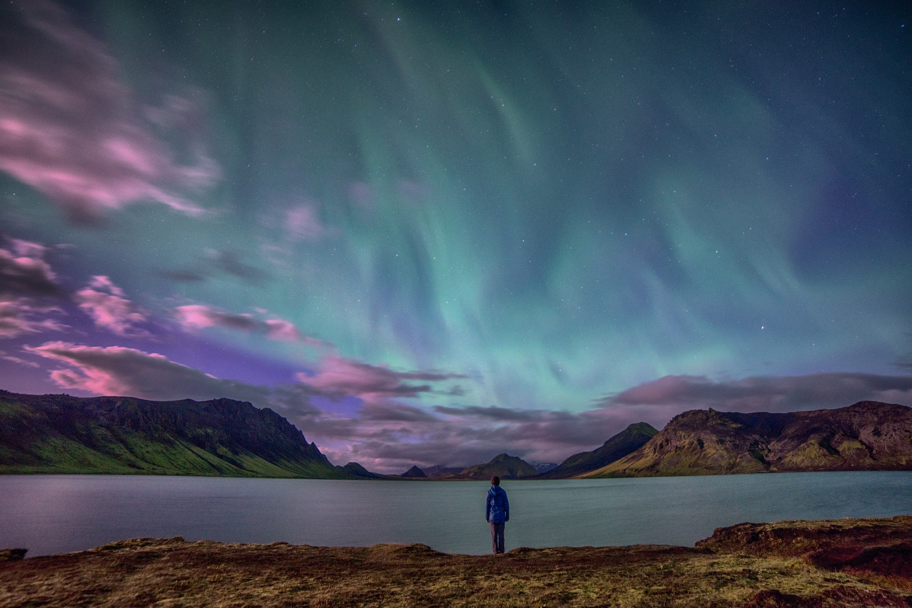
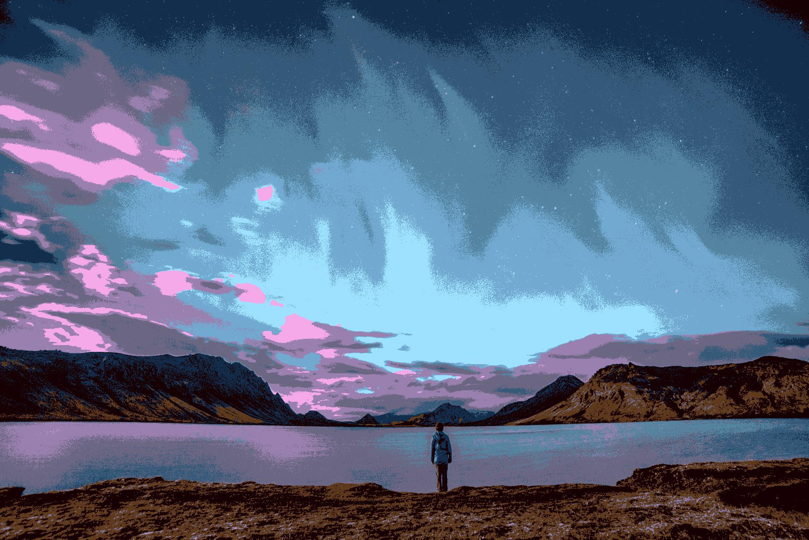

# Description 
Using a k-mean clustering model to generate user-define color segmentation, and create a new image based on the obtained color segmentation

## Arguments
- -p --path path/to/import/image
- -n --numberOfCluster number of clusters
- -s --show display result image
- -d --dest path/to/save/result


## Usage ##
```python
python color segementation.py -p aurora.jpg -n 10 -s -d result.jpg
```

## Example of Results 
Original Image
<div>
  
</div>
Result after using k-mean model with 10 segments
<div>
 
</div>
